# 台股強勢股隔日放空策略研究

## 研究摘要
本研究在學長指導下，探討台指期、加權指數、櫃買指數的日內走勢型態，
對台股強勢股隔日表現的預測力，並據此設計隔日放空策略。
研究歷經多次方向調整，最終發現「三指數同步開低走高 + 小型高周轉強勢股」
具有穩定的均值回歸特性。

## 最終策略與績效

### 策略邏輯
- 訊號：TX、TAIEX、TPEx 三指數同日皆為「開低走高」
- 標的：當日漲幅 8%-9.5% 的個股
- 篩選：市值 ≤100億、周轉率 ≥0.5%、可現股當沖賣
- 進場：隔日開盤放空
- 出場：隔日收盤回補
- 停損：8%
- 滑價：單邊 0.15%
- 手續費：單邊0.001425×0.6折 + 當沖證交稅0.003×0.2折

### 績效（2015-2026，1口/張）
| 指標 | 數值 |
|---|---|
| Sharpe Ratio | 3.16 |
| 勝率 | 58.6% |
| 總損益 | +188,775 |
| 最大回撤 | -26,140 |
| 交易筆數 | 389 |
| 逐年為正比例 | 10/12年 |

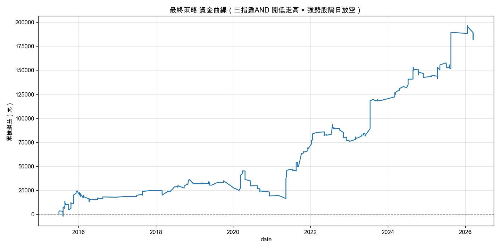
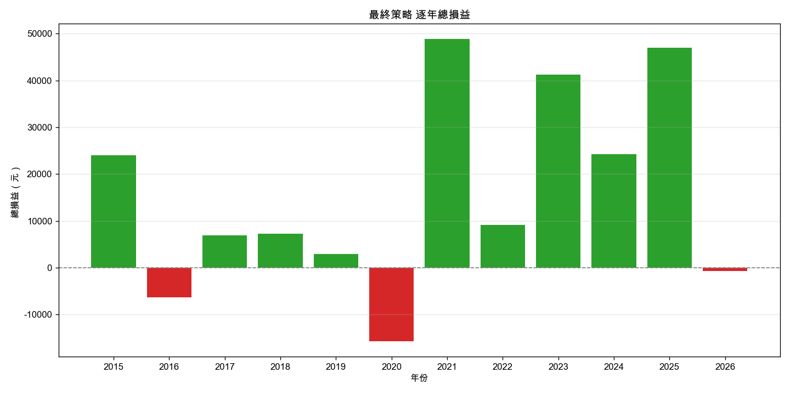

---

## 研究流程

### Part 1：大盤指數行為分析

#### 1.1 三指數跳空特性比較
比較台指期、加權指數、櫃買指數的日內跳空幅度分布。
發現台指期跳空最劇烈（std 0.61%），加權指數中等（std 0.33%），
櫃買指數幾乎不跳空（std 0.11%）——這影響了後續region分類門檻的選擇。

#### 1.2 Region定義
採用「開高/開低 × 走高/走低」四象限分類：
- 開高走高、開高走低、開低走高、開低走低
三個指數各自獨立計算region。

#### 1.3 三指數Region初步回測（放空台指期一口）
測試三個指數（TX、TAIEX、TPEx）各自的四個region，
隔日放空台指期一口的績效。

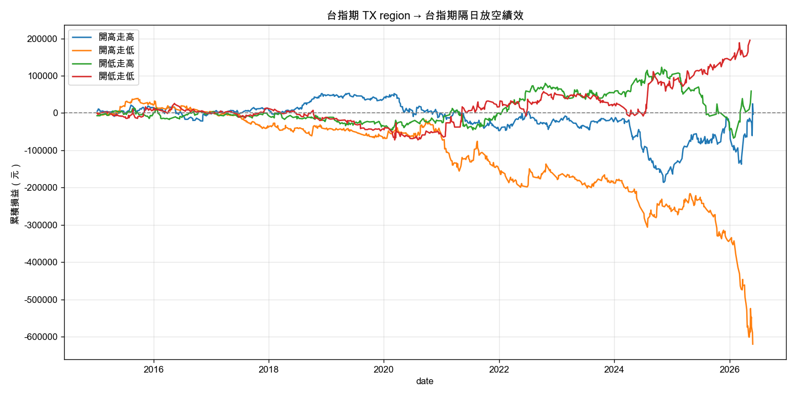
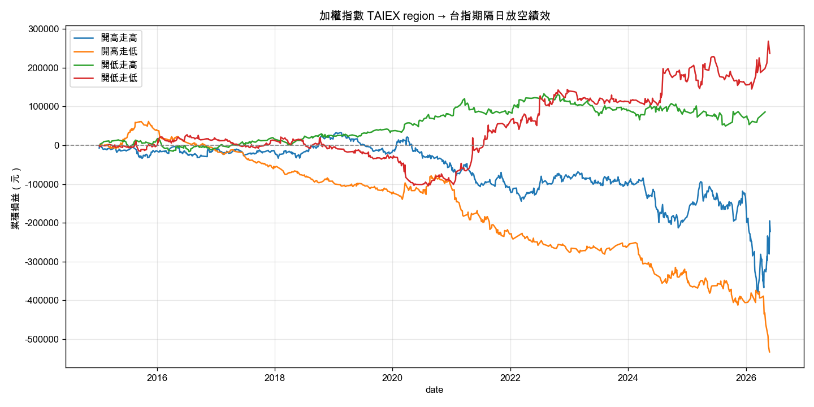
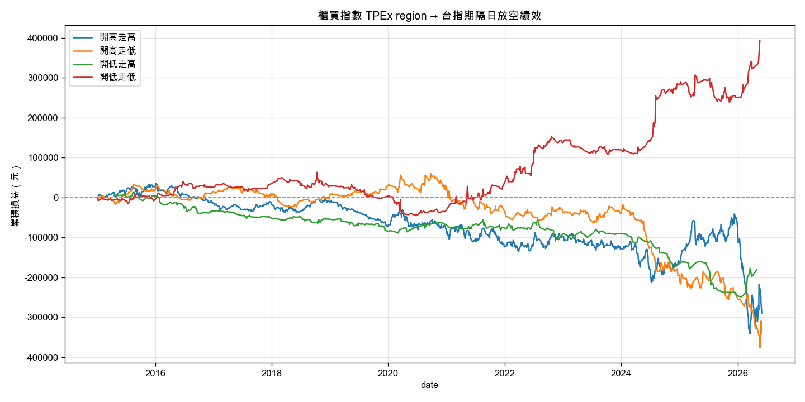

**結論：三個指數的「開低走低」初步看似最佳，
但僅是放空台指期本身，尚未涉及個股。**

---

### Part 2：早期探索（漲停股方向，已放棄）

#### 2.1 收盤鎖漲停事件 × TX四象限
以「收盤價=漲停價」定義事件（626筆，2015-2026）。
**結論：事件高度集中在約15-20個大盤噴出日，樣本碎片化，無統計意義。**

#### 2.2 盤中觸及漲停（high版）
放寬定義為「當日最高價觸及漲停價」（1061筆）。
**結論：事件仍集中於相近交易日，問題未解決。**

#### 2.3 TX×S&P500交叉驗證
測試「TX region × 全球同步/逆勢」交叉訊號。
**結論：交叉後樣本進一步碎片化（部分組合僅4-11個交易日），
高Sharpe為單日群聚假象，非真實edge。**

> 上述探索促成了關鍵轉向：放棄「漲停」作為事件定義，
> 改用「漲幅門檻」以大幅擴增樣本量。

---

### Part 3：強勢股放空策略（最終採用方向）

#### 3.1 強勢股門檻初步測試
以TPEx「開低走高」這個region為例，測試強勢股漲幅門檻5%-9%，
發現Sharpe在7-8%出現明顯峰值（其餘三個region則無此結構，
多數呈現負值或無規律震盪）。此結果支持後續鎖定「開低走高」
作為主要訊號方向的選擇。

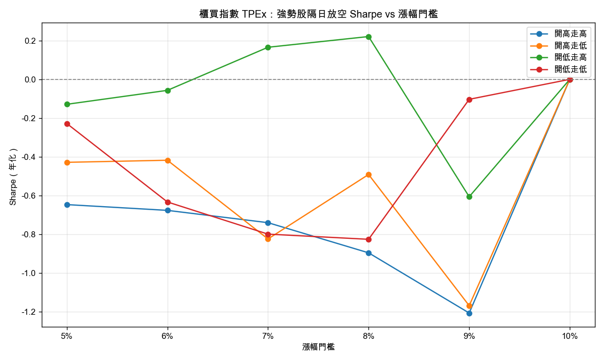

#### 3.2 三指數訊號組合測試（AND/OR）
比較單一指數 vs 多指數疊加（AND）的效果。

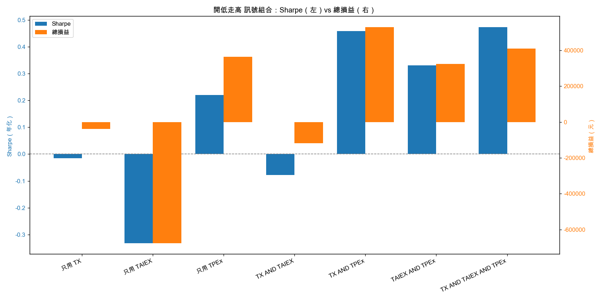

**結論：三指數同步開低走高（AND）顯著優於單一指數，
Sharpe由單指數最佳0.67提升至0.91（未計入交易成本前）。
TAIEX單獨表現弱（Sharpe 0.09），但作為AND條件之一仍有貢獻——
顯示其作用是「確認」而非「獨立訊號」。**

#### 3.3 加入真實交易成本
加入停損8%、滑價0.15%後重新檢視。
**結論：Sharpe由0.91降至0.47，交易摩擦吃掉約一半績效，
顯示先前無摩擦版本的高Sharpe有相當部分是理論值。**

#### 3.4 市值濾網（Grid Search）
測試市值上限 5億/10億/20億/30億/50億/100億/200億/不限。

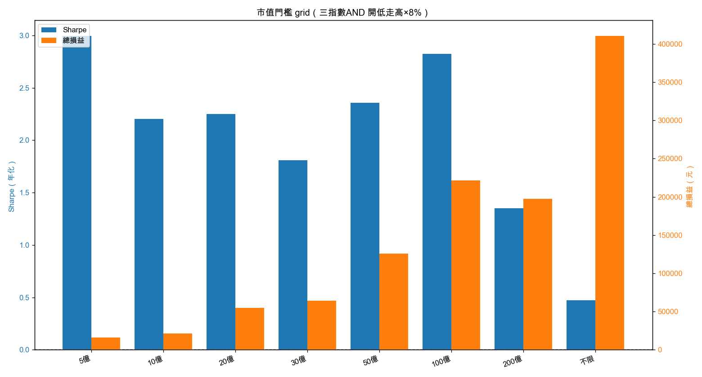

**結論：市值≤100億時Sharpe由0.47跳升至2.82，最大回撤同步縮小一個量級。
大型股的8%漲幅多為真實動能延續（放空易被軋），
小型股的8%漲幅較多屬情緒性追高（隔日易回落）。**

#### 3.5 周轉率濾網（Grid Search）
測試周轉率下限 0.5%/1%/1.5%/2%/3%/5%/不限。

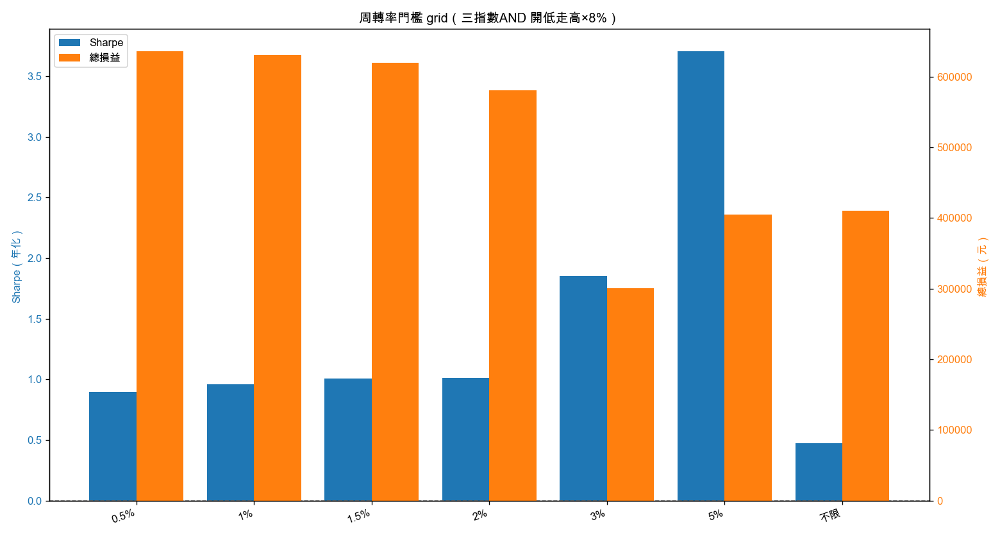

**結論：周轉率越高，放空績效越好；低周轉強勢股為策略中的淨輸家來源。**

#### 3.6 市值+周轉率疊加
將兩濾網疊加（市值≤100億 且 周轉率≥0.5%）。
**結論：Sharpe達3.16，最大回撤縮至-26,140，
逐年拆解顯示10/12年為正，不依賴單一年份撐場
（2021、2023、2024、2025均有可觀貢獻）。**

#### 3.7 當沖限制分類
依台灣現股當沖規則，將事件分為三類：
可現股當沖賣 / 暫停先賣後買 / 可資券沖。

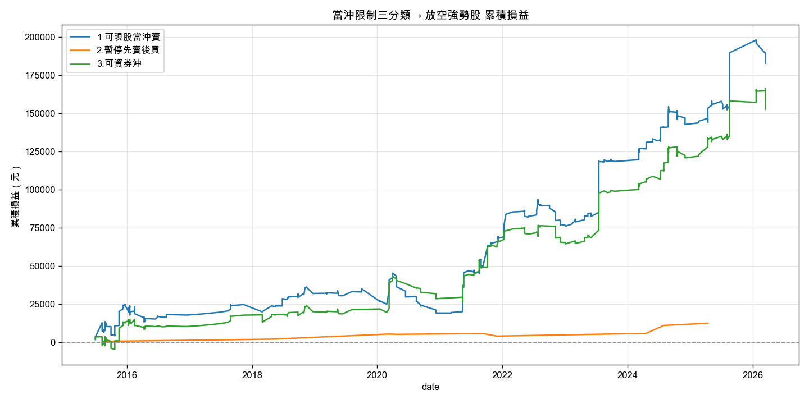

**結論：約80%事件同時具備融券額度（class 3），
且該子集表現略優於全體（Sharpe 3.31 vs 3.16），
顯示借券可行性的疑慮部分獲得緩解，惟仍須查證實際券源鬆緊。**

#### 3.8 分點籌碼分析
測試兩種分點特徵（資料僅涵蓋2022年後）：

**1. 追高分點數**（最高價位買進分點數量）

| 分組 | 事件筆數 | 平均每筆損益 | Sharpe | 勝率 |
|---|---|---|---|---|
| 1-2個 | 26 | 708元 | 5.78 | 61.5% |
| 3-5個 | 27 | 592元 | 3.98 | 63.0% |
| 6個以上 | 110 | 792元 | 4.19 | 60.0% |

累積損益曲線（下圖）容易因樣本數差異造成誤導——「6個以上」組
事件數是其他組的4倍，總損益自然較高。但比較「平均每筆損益」
與「Sharpe」後可發現，三組品質其實相近（平均每筆約600-800元，
Sharpe在4-6之間跳動、無單調關係），顯示追高分點數對隔日放空
績效沒有穩定的區分力，原假設不成立。

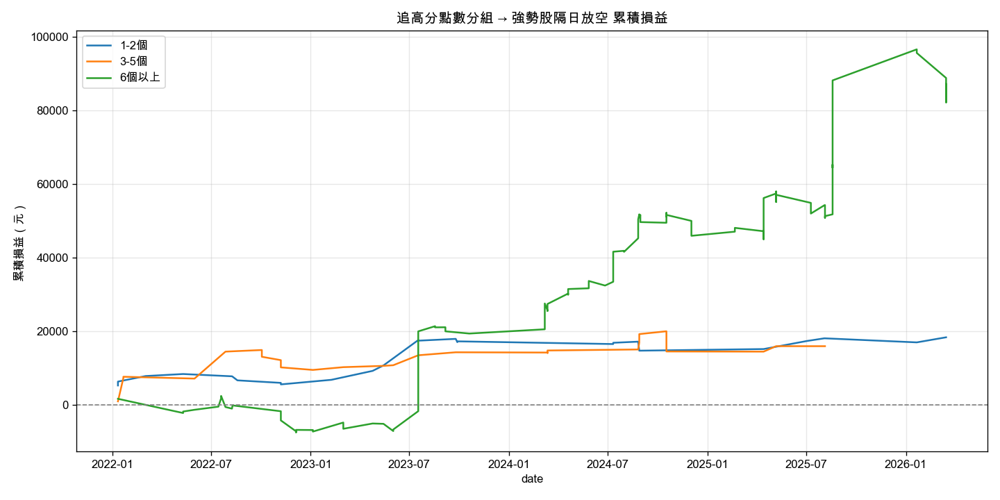

**2. 主力集中度**（前三大買超分點占成交量比例）

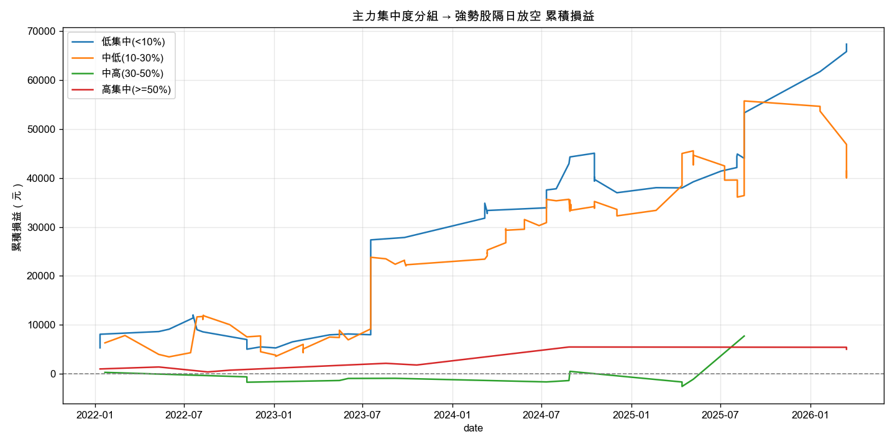

**結論：與直覺相反，低集中度（<10%，散戶分散追買）組勝率最高（71.7%），
優於高集中度組（~55%）。推測主力控盤股隔日仍有撐盤力道，
散戶推升的個股則無人接手、易自然回落。
惟此特徵受限於分點資料僅2022年後可用，樣本量（53筆）偏少，
暫列為「潛力濾網」而非正式採用。**

#### 3.9 強勢股門檻穩健性複測（含完整濾網）
在市值+周轉率濾網已套用的前提下，重新測試門檻5%-9%。

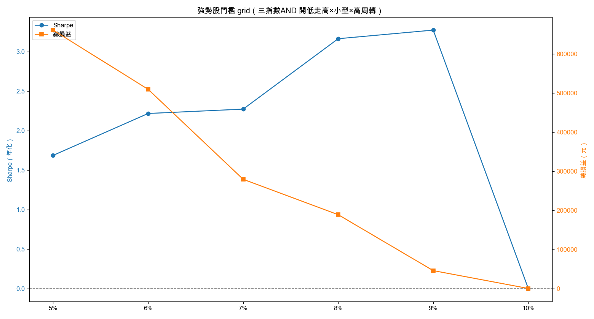

| 門檻 | 交易筆數 | 總損益 | 勝率 | Sharpe | 最大回撤 |
|---|---|---|---|---|---|
| 5% | 2669 | +661,215 | 59.8% | 1.69 | -112,199 |
| 6% | 1605 | +509,640 | 60.7% | 2.22 | -58,517 |
| 7% | 845 | +279,342 | 59.1% | 2.27 | -45,855 |
| 8% | 389 | +188,775 | 58.6% | 3.16 | -26,140 |
| 9% | 115 | +45,612 | 53.0% | 3.27 | -10,821 |

**結論：加入濾網後，門檻5%-8%區間勝率穩定在58-61%、全數正報酬，
顯示策略edge對門檻選擇不敏感（非過度擬合單一參數）。
門檻選擇成為「總報酬規模」與「風險調整後報酬」的權衡：
門檻越低，總損益與容量越大但Sharpe較低；
門檻越高，Sharpe與回撤控制越佳但絕對金額縮小。
最終採用的8%是偏向Sharpe優化的折衷點；
若以容量與總報酬為優先，6%-7%是更具吸引力的選擇。**

#### 3.10 停損優化（Grid Search）
測試停損1%-10%及不設停損。

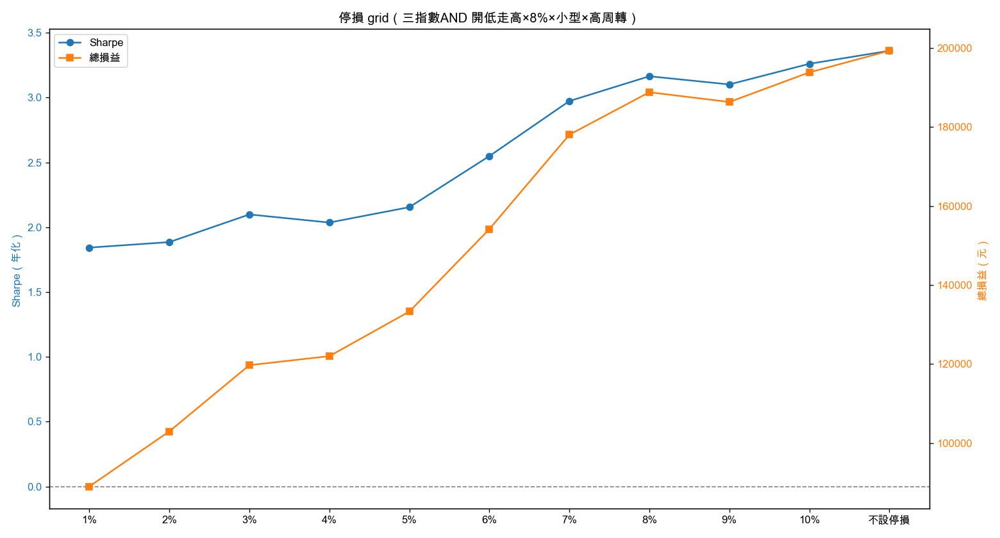

| 停損 | Sharpe | 總損益 | 勝率 | 停損觸發次數 |
|---|---|---|---|---|
| 1% | 1.84 | +89,008 | 28.5% | 260 |
| 5% | 2.15 | +133,267 | 56.0% | 72 |
| 8% | 3.16 | +188,775 | 58.6% | 27 |
| 不設停損 | 3.36 | +199,267 | 58.9% | 0 |

**結論：策略本質為「開盤空、收盤補」的日內均值回歸單，
緊停損容易在盤中反彈時被洗出場，反而傷害績效（1%停損勝率僅28.5%）。
理論最優為不設停損，但回測無法捕捉「標的鎖死漲停、當日無法回補」
的尾部風險。8%停損幾乎不觸發（27次/389筆），對績效影響極小，
同時提供災難保護，為實務上的合理折衷。**

---

## 已知限制與待驗證事項
1. **借券成本未納入回測**：策略標的偏好小型高周轉股，
   實務借券費與券源鬆緊度需另行查證。
2. **分點資料覆蓋有限**：僅2022年後可用，主力集中度發現
   （Step 3.8）尚待更長期資料驗證。
3. **未做嚴謹的In-sample/Out-of-sample切分**：
   現有驗證以逐年拆解為主，建議後續以2015-2022為樣本內、
   2023-2026為樣本外做正式驗證。
4. **未考慮資金規模與容量限制**：所有回測均為1口/張，
   實際部署需評估該濾網下標的的市場深度。

---

## 檔案結構
```
.
├── README.md
├── main_final.py              # 最終策略執行入口
├── index_region_backtest.py   # 主要回測引擎與所有Grid Search
├── portfolio_backtest.py      # 投資組合回測框架
├── data_loader.py             # FinMind資料抓取與快取
├── market_scanner.py          # 漲停/強勢股事件偵測
├── strategy.py                # Region分類邏輯
├── data/                      # 全市場OHLCV快取（CSV）
│   ├── mv/                    # 市值資料快取
│   └── broker/                # 分點資料快取
├── output/                    # 所有研究圖表
└── archive/                   # 已放棄的探索路徑與腳本
```

## 執行方式
```bash
python main_final.py
```
